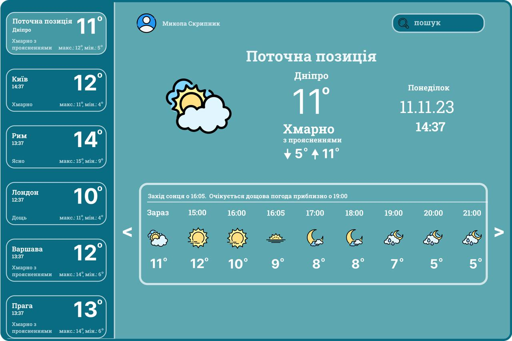
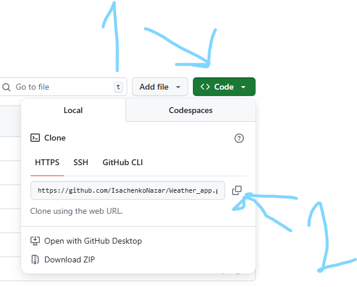

# Weather application

Цей проект розроблено з метою ознайомлення із роботою API, принципом отримання даних від віддаленого серверу, вмінням їх обробляти, структурувати та застосовувати у своємо проєкті. А саме застосовувалось API такого веб-ресурсу як [OpenWeatherMap](https://openweathermap.org). Проєкт допоможе розібратися із роботою файлів JSON, як правильно отримувати та зберігати дані у файлах з типом .json. Та познайомити користувача з інтерфейсом застосунку розробленим за допомогою пакету [CustomTkinter](https://customtkinter.tomschimansky.com)

### Зміст репозиторія:

1. [Основні модулі проєкту](#all-modules)
2. [Розгортання проєкту](#download-project)
3. [Створення віртуального оточення проєкту](#create-venv)
4. [Завантаження модулів до віртуального оточення](#download-modules-venv)
5. [Старт проєкту](#start-project)
6. [Основні механіки проєкту](#all-mechanics)
7. [Висновок по проєкту](#result) 
___
<h4 id= 'all-modules'>Основні модулі проєкту:</h4>
All modules

- [customtkinter](https://customtkinter.tomschimansky.com/)
- [json](https://docs.python.org/3/library/json.html)
- [requests](https://requests.readthedocs.io/en/latest/)
- [pillow](https://pillow.readthedocs.io/en/stable/)
- [os](https://docs.python.org/3/library/os.html)
- [colorama](https://pypi.org/project/colorama/)
- [datetime](https://docs.python.org/3/library/datetime.html)
___
<h4 id= 'download-project'>Розгортання проєкту:</h4>
Download project

1. Склонувати з Git Hub репозиторію
    

    - натиснути на кнопку "Code"
    - скопіювати проєкт

2. Завантажити за допомогою zip-архіву
    
    
    - треба знову натиснути "Code"
    - та завантажити через zip-архів
___
<h4 id= 'create-venv'>Створення віртуального оточення проєкту:</h4>
Сreate venv

1. Windows
   
   
   
    - для цього потрібно прописати команду яка на зображенні
    - друге venv - назва нашого оточення
    
    

    -команда для активації віртуального оточення

2. Mac OS або Linux
   
   
   - для створення на Mac OS використовується таж команда

   

    - команда для активації віртуального оточення
    але замість Scripts пишемо bin
   
___
<h4 id= 'download-modules-venv'>Завантаження модулів до віртуального оточення:</h4>
Download modules venv

1. Окремими модулями
    
    
 
    - Потрібно прописати pip install та назву модуля який потрібно завантажити

2. За допомогою файлу requirements.txt
    
    
   
    - завантажити за допомогою requirements
___
<h4 id= 'start-project'>Старт проєкту:</h4>
Start project

    - потрібно прописати у терміналі  python та назву файлу який потрібно запустити

___
<h4 id= 'all-mechanics'>Основні механіки:</h4>
all-mechanics

___
<h4 id= 'result'>Висновок по проєкту:</h4>
 result

В цьому проєкті я навчився краще працювати в команді, комунікувати з іншими, та зрозумів наскільки це важливо.

      - Проблеми з якими ми зіткнулися:

        1.Проблеми з кодом або відсутність ідей, що робити.

        2.Відсутність деяких учні на занятті за поважною причиною, а також відсутність заняття через хворобу ментора

      - З чим ми познайомились
        Ми познайомилися з різними модулями та бібліотеками такими як:

        1.Tkinter - "стандартна бібліотека Python для створення графічного інтерфейсу для створення користувача",
        який містить віджет.Віджет -графічні компоненти, з яких будується інтерфейс користувача

        Основні віджети:

        1.button - "створення кнопки",

        2.PhotoImage - "додати зображення",

        3.text - "додавання многострокового поля для написання тексту",

        4.tkMessageBox - "створення діалогових вікон".

        Розміщення віджетів
            pack() - розміщення віджетів на вікні  основні параметри(
            side:
                Вказує, до якої сторони батьківського віджета буде прикріплений віджет. Можливі значення: TOP, BOTTOM, LEFT, RIGHT
            fill:
                Вказує, як віджет повинен заповнювати простір у батьківському вікні. Можливі значення: X (заповнює горизонтально), Y (заповнює вертикально), BOTH (заповнює обидва напрямки), або None (не     заповнює).
            padx і pady:
                Вказують відступи у пікселях по горизонталі та вертикалі відповідно.
            
            )
            grid() - використовується для розміщення віджетів у вікні, організовуючи їх у вигляді таблиці сітки):
                Основні параметри:
                    row: Номер рядка, в якому розміщується віджет (починається з 0).
                    column: Номер стовпця, в якому розміщується віджет (починається з 0).
                    columnspan: Скільки стовпців займає віджет (за замовчуванням 1).

            
            )
            place() - використовується для розміщення віджетів у графічному інтерфейсі за допомогою  відносних координат:

            x і y:    
                Задають абсолютні координати (в пікселях) відносно верхнього лівого кута батьківського віджета.
            relx і rely:
                Задають відносні координати (від 0.0 до 1.0) відносно ширини та висоти батьківського віджета.
            width і height:
                Задають абсолютні ширину і висоту віджета в пікселях.
            
        
        

        2.Json - "текстовий формат для обміну даних"

        JSON-дані складаються з об'єктів та масивів.
        Об'єкт - це набір пар "ключ: значення", 
        ключі - це рядки, а значення можуть бути рядками, числами, булевими значеннями, іншими об'єктами або масивами. 
        
        3.Api - "це посередник між програмами, який задає правила «спілкування»".

        використання API:
    1. Ознайомлення з документацією API:
        Кожен API має свою документацію, в якій описано, які функції він пропонує, які запити можна надсилати та які відповіді очікувати. 
    2. Вибір HTTP-методу:
        Найчастіше використовуються GET (для отримання даних) та POST (для створення або оновлення даних). 
    3. Формування запиту:
        Запит містить URL API, HTTP-метод, заголовки (headers) та тіло запиту (body), якщо потрібно. 
    4. Надсилання запиту:
        Запит надсилається до API за допомогою HTTP-клієнта. 

 

 
